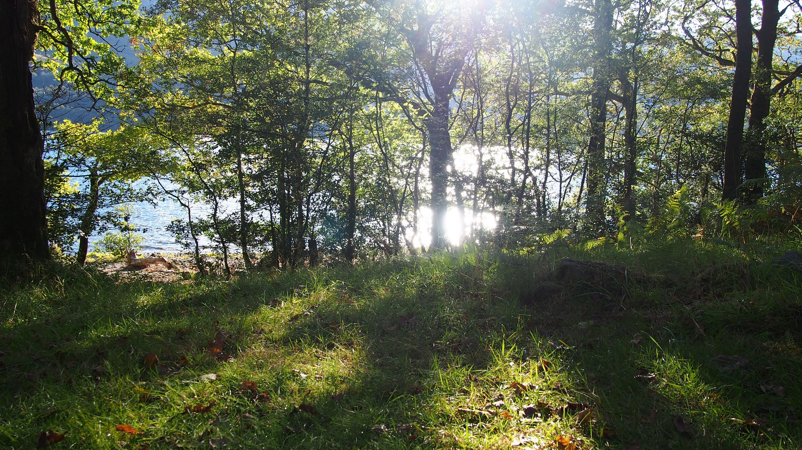
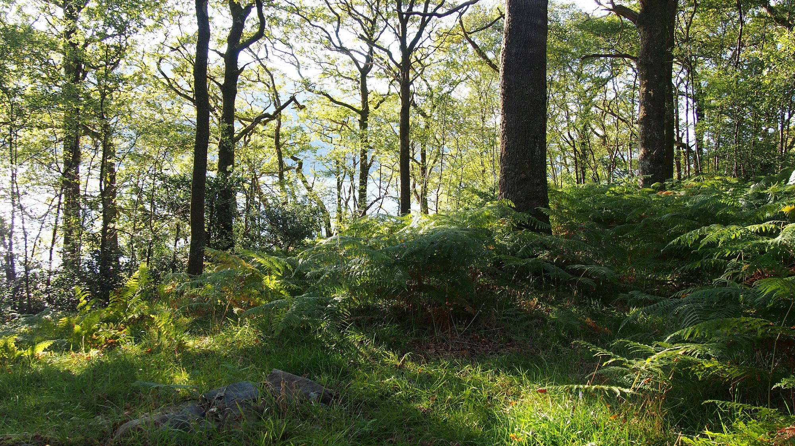
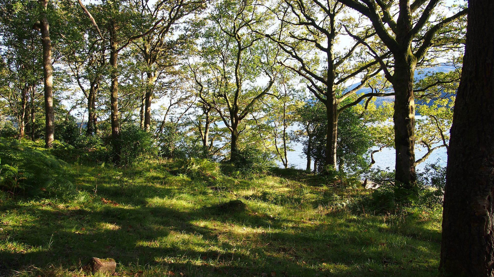
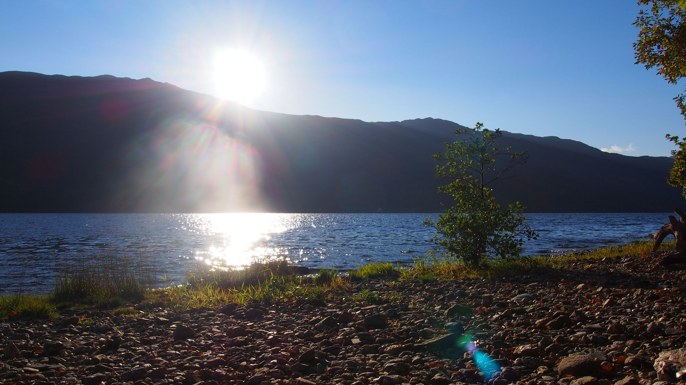
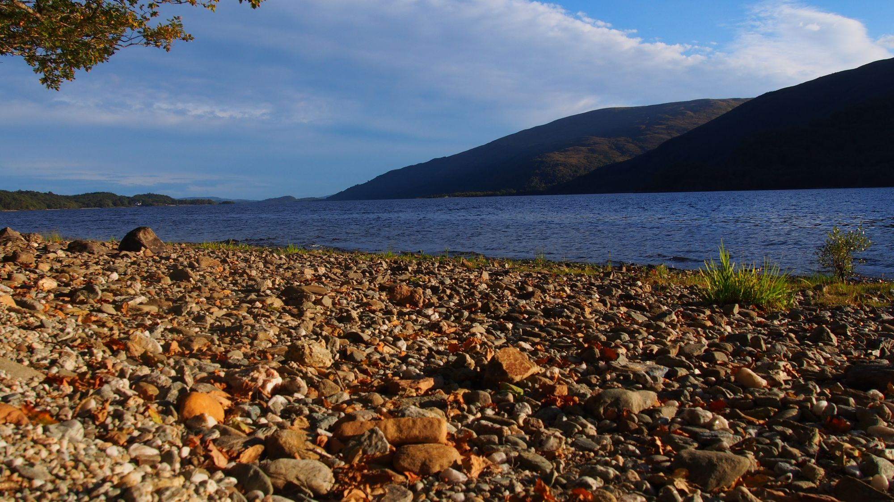
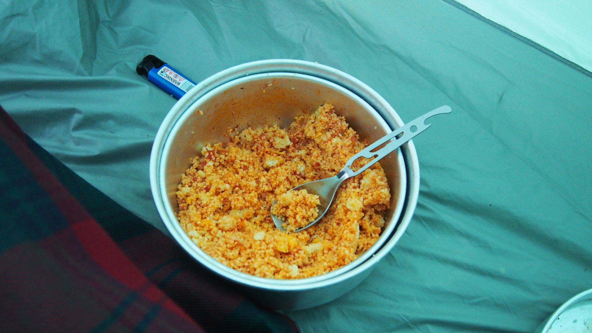
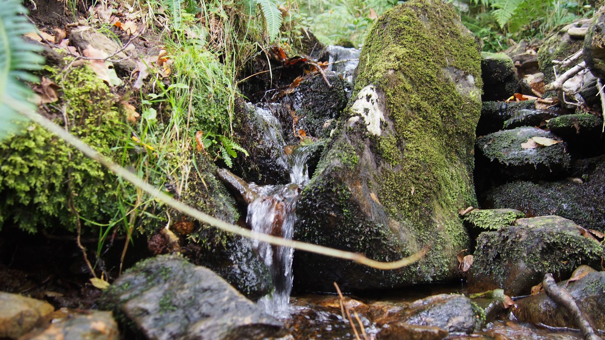

Es wirkt nicht als hätte es viel geregnet, aber es hat ausgereicht mich heute Nacht kurz zu wecken. Das Zelt hat die erste Taufe überstanden und ich bin trocken geblieben. Nach einem Tee und etwas zum essen werde ich das Zelt abbauen und mich auf den Weg machen. Ich habe mir als Ziel wieder 20 Kilometer gesetzt, mal schauen ob ich sie heute hinter mich bringe.

## Querfeldein

Ich bin meinem Ziel nachgekommen und bin vom Weg abgewichen. Clever wie ich bin dachte ich mir ich nutze dies gleich um mir eine Biegung zu sparen und eine Abkürzung zu laufen. Leider kam recht bald der erste Zaun, der mich aber nicht hinderte sondern über den ich direkt kletterte. Kühe mit hörnen waren nicht aus zu machen weswegen ich mir keine sorgen machten durch mein Eindringen auf unliebsame Gegenfreude zu stoßen. Das groß ist Nass und der Boden matschig, aber dies hält mich nicht ab. Schließlich habe ich keine Hose die Nasswerden kann und das Kilt ist der dicht gewebt, so dass ich mir darum keine sorgen mache. Der Weg über stock und stein ist deutlich beschwerlicher, aber ist es nicht genau das was ich wollte — Einsamkeit habe ich hier auf jeden Fall. Dennoch ist es mein Ziel zurück zum weg zu kommen, um nicht die Orientierung zu verlieren. So gehe ich schritt für schritt über Stock, Stein und Zaun und “genieße” die Einsamkeit. Zurück auf dem weg stelle ich leider nur fest das meine Schuhe komplett durchnässt sind. Diese hatte ich in meine Berechnung nicht ganz mit aufgenommen. Es ergibt wohl doch sinn Schuhe zu imprägnieren, doch der Gedanke birngt mir aktuell reichlich wenig. Mit nassen Schuhen zu wandern ist nicht so angenehm aber bis morgen werden sie schon wieder trocken sein.

## Kulinarische Feldküche

Vor meinem Aufbruch aus Glasgow habe ich mir ein Glas Tomatensoße gekauft, da ich mir dachte Couscous alleine ohne Beilage wird doch auf Dauer etwas fad. Um Gewicht zu sparen habe ich als Proviant eigentlich nur Couscous, rote Linsen und ein paar Protein Schokoladenriegel eingepackt (letzte als Süßspeise die ich mir noch eisern aufhebe). Dabei wusste ich vorher noch nicht mal ob mir Couscous überhaupt schmeckt. Wie ich gestern erfreulich festgestellt hab, kam man Couscous gut pur essen, mit der Tomatensoße schmeckt es leider zum Kotzen — was als Delikatesse gedacht war entpuppt sich als totaler Reinfall. Die Portion dich ich als Abendessen geplant hab bekomm ich auf jeden Fall nicht komplett in mich hinein, aber der Hunger vergeht mir auch recht schnell. Doch ein gutes hat die Mischung: Ich werde mich bestimmt nicht darüber ärgern keine Beilage zu dem Couscous zu haben.

