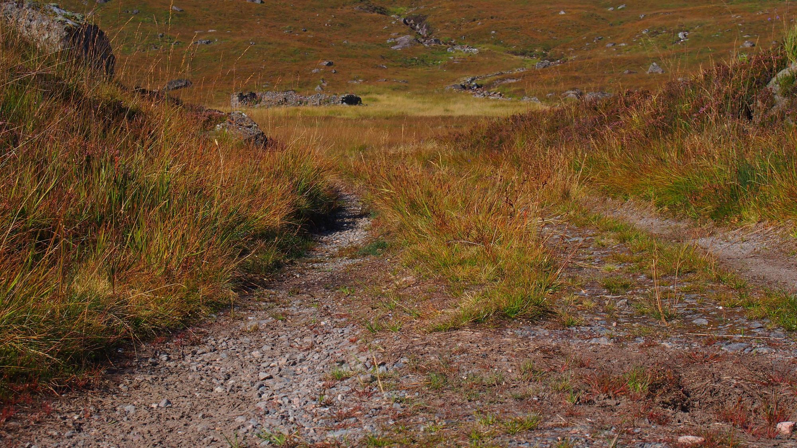
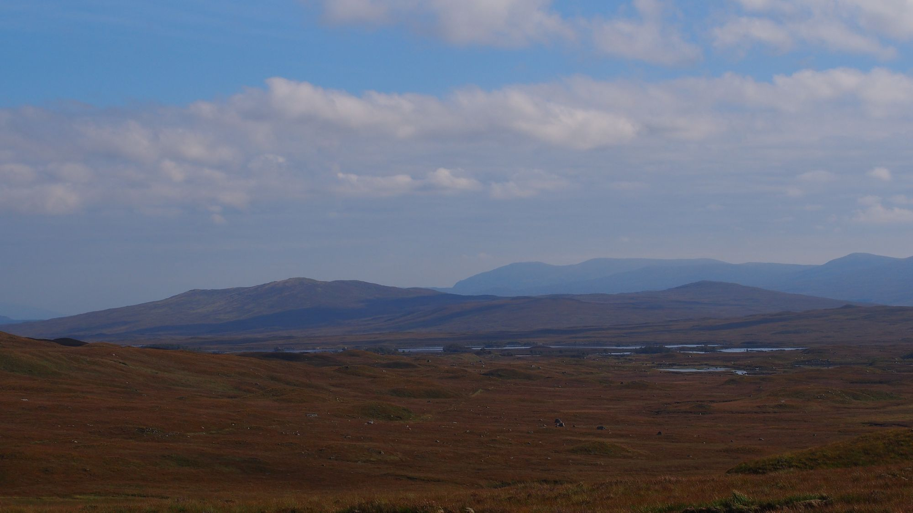
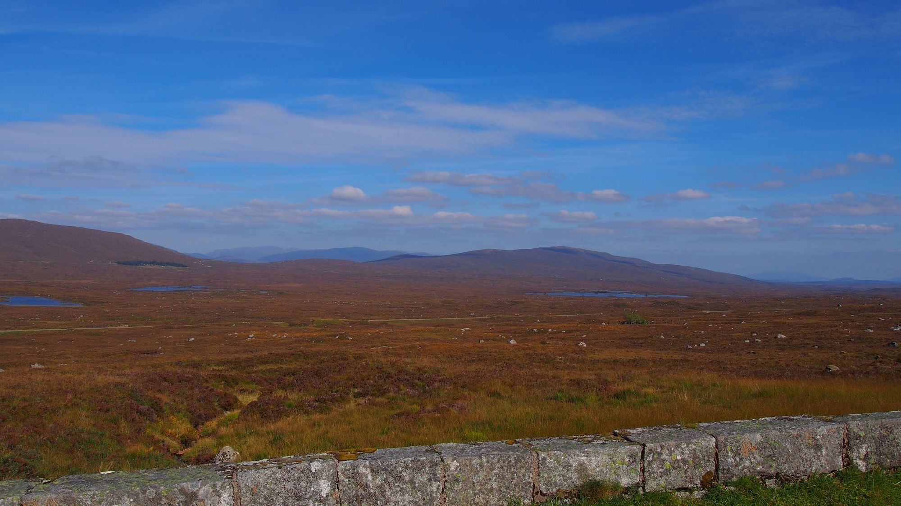
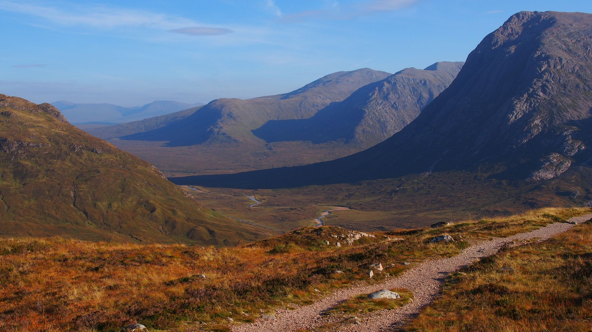

Vermutlich werde ich den Flug doch umbuchen müssen und etwas früher fliegen, da die Nächte kaum noch auszuhalten sind. Irgendwie muss ich das innere meines Schlafsacks warm bekommen. Auch habe ich noch nicht die Hoffnung aufgegeben, dass ich einen Courchsurfing Host finde, der mich beherbergt, so dass ich keine Zeit mehr schinden und frieren muss.

Obwohl es Nachts so kalt ist, habe ich Tagsüber großes Glück mit dem Wetter. Von dem englischen Regenwetter habe ich noch nicht viel mitbekommen. Genau genommen hatte ich bisher nur an einem Tag Regenwetter und die restlichen Tage Sonnenschein. Darüber will ich mich hier aber nicht beschweren und die Sonnenstrahlen auf meiner Haut genießen. Während ich meine Topf Linsen verdauend auf einer Brück sitzen. Hinter mir das Rauschen von Wasser vor mir der Blick in ein Tal voller kleiner Seen. Die Tage in der Natur machen die kalten nachte mehr als wett.

## Gewaltmarsch

Ich habe mich entschieden schneller voran zu gehen, um etwas Wärme zu tanken und in Fort William ein Hostel auf zu suchen — zumindest für eine Nacht. Dafür bin ich gestern an meine grenzen gegangen und 30km Berg auf und ab gelaufen. Es ist eine Freude hier in den Highland immerhin keine großen Wassermengen mit sich rum tragen zu müssen aber der Schwere Rucksack und das Nasse Zelt fordern auch ihren Tribut. Ich hätte auch gerne schon früher einen Stop eingelegt, aber es gab keinen guten Platz das Zelt auf zu stellen. Auch der Platz den ich gefunden habe ist nicht Optimal für mein Zelt, dass zwar super leicht alleine aufgebaut werden kann, aber nur stehen bleibt wenn es mit den Karabinern im Boden verankert wird.

