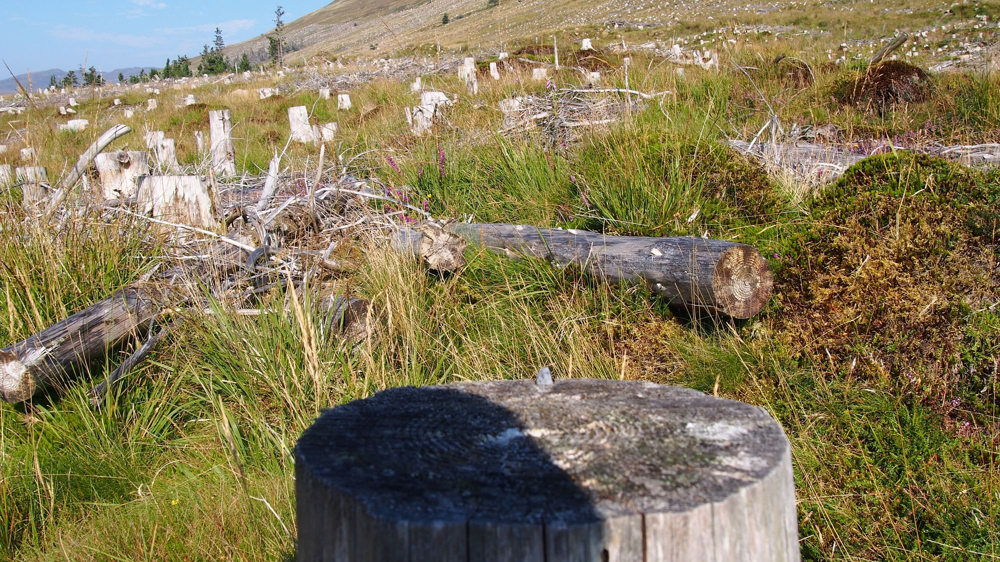
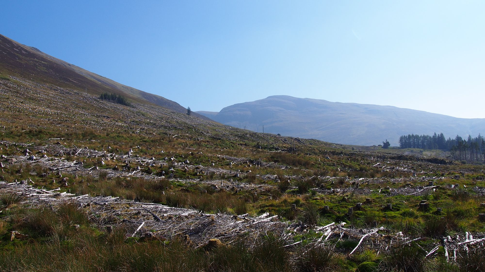
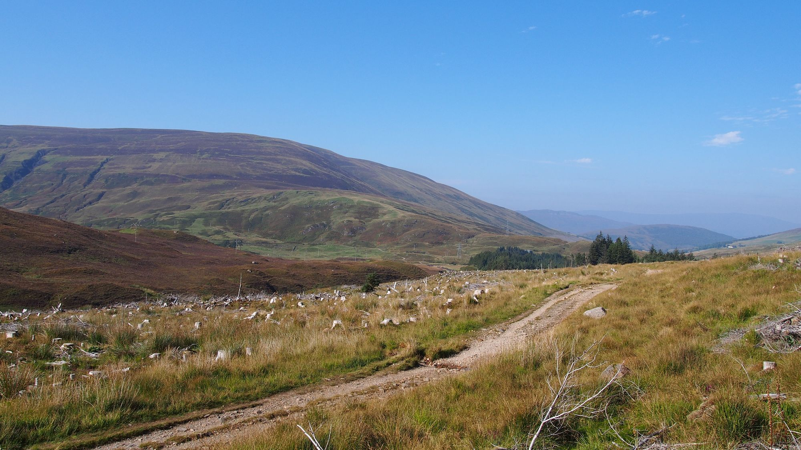
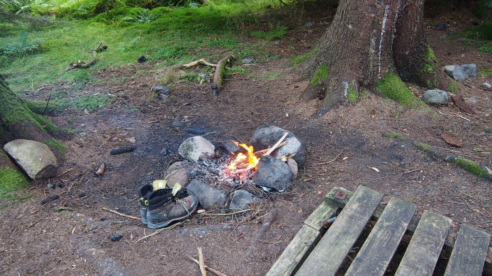

Ich bin kurz vor Fort William, meiner Hoffnung auf einen warmen Schlafplatz. Ich habe mich dennoch noch einmal dafür entschieden mein Zelt auf zu schlagen, da ich mir mehr Hoffnungen mache einen platz im Hostel zu bekommen, wenn ich morgens anreise. Außerdem habe ich dann morgen den ganzen Tag Zeit den Ort zu erkunden. Der Platz unter den Kiefern ist sehr einladend und die Nadeln haben eine Prima Zündgrundlage gegeben, so das ich an meinem ersten komplett selbst entzündeten Feuer sitze und den Abend ausklingen lasse.

## Verschwundener Wald

Ich laufe durch einen tiefen Wald, rechts von mir Bäume. Ein wunderschöner Ort. Schritt für Schritt tragen mich meine Beine voran, vorbei an dunkelgrünen Nadelbäumen auf eine Lichtung. Doch es ist viel zu groß für eine Lichtung, doch auch weide Land ist nicht selten hier und ich denke mir nichts weiter dabei. Rechts und Links von mir Wiese mit Baumstümpfen, ein Fläche soweit ich blicken kann und darüber hinaus. Ich bin verwundert, hatte ich doch vor kurzem noch die Karte studiert und war der Überzeugung auf den nächsten Kilometern hauptsächlich Wald zu durchqueren. Ich konsultiere die Karte erneut, schließlich ist diese nur zwei Jahre alt und ich mache mir sorgen mich verlaufen zu haben, schließlich wird in dieser Zeit niemand den ganzen Wald abgeholzt haben. Ich gehe meine Route durch, blicke auf die Karte, schau umher und kann kaum glauben was ich sehe.

## Metal

Es kam ein junger Metaller vorbei der mich direkt angesprochen hat, da er eine Zeitlang selbst direkt an der Stelle gezeltet hat. Ich weis nicht mehr von wo er ursprünglich kam, aber er war wohl die ersten Wochen Obdachlos als er nach Schottland kam und hat genau an der gleichen stelle kampiert.

