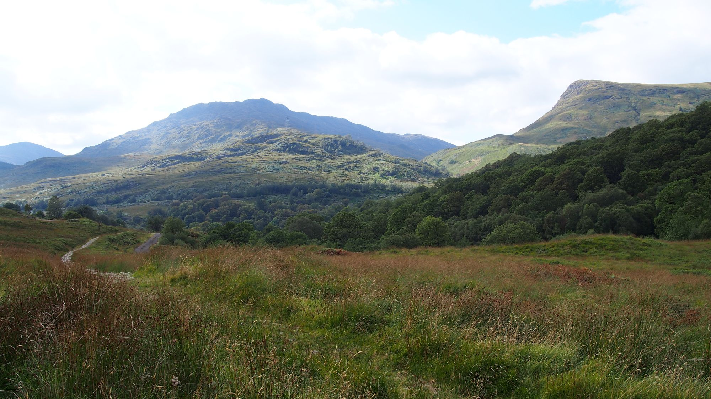
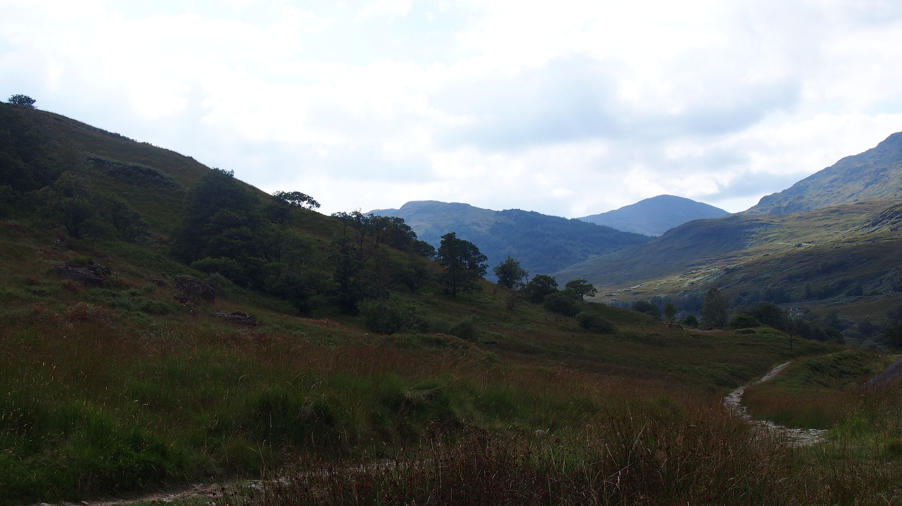
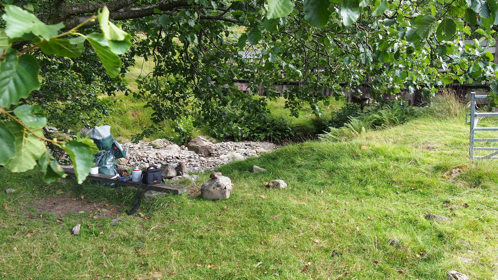
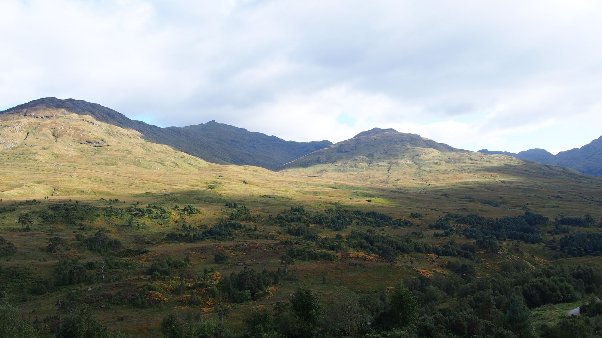
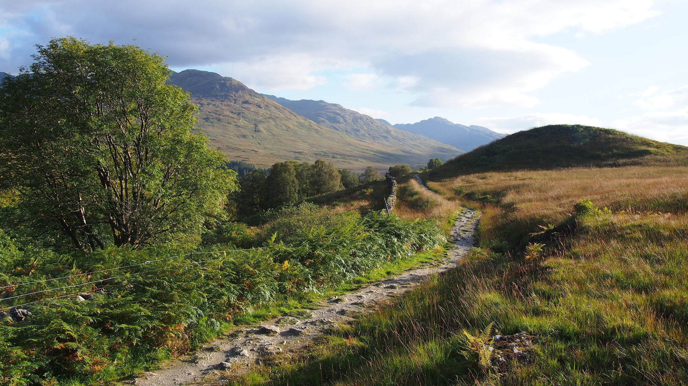
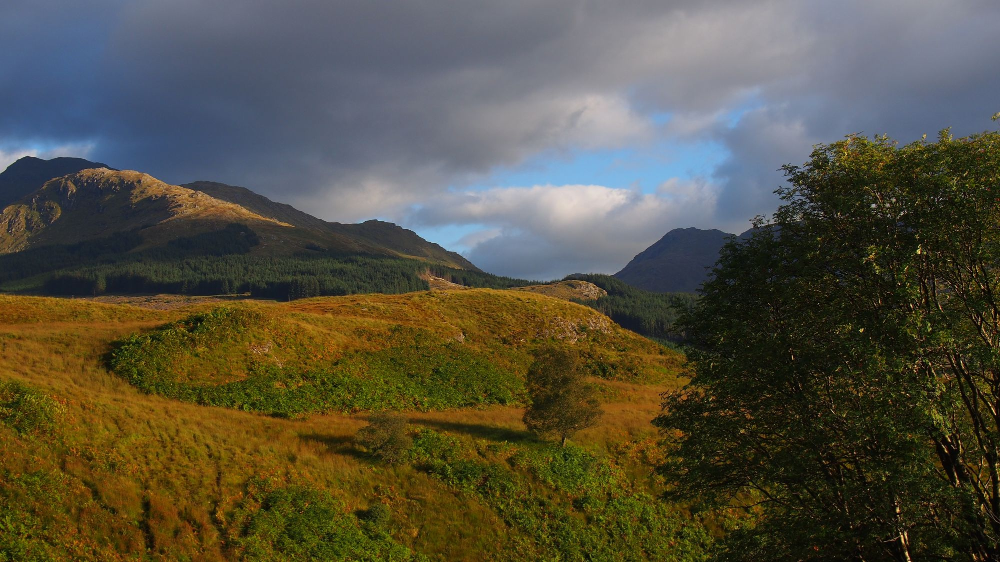
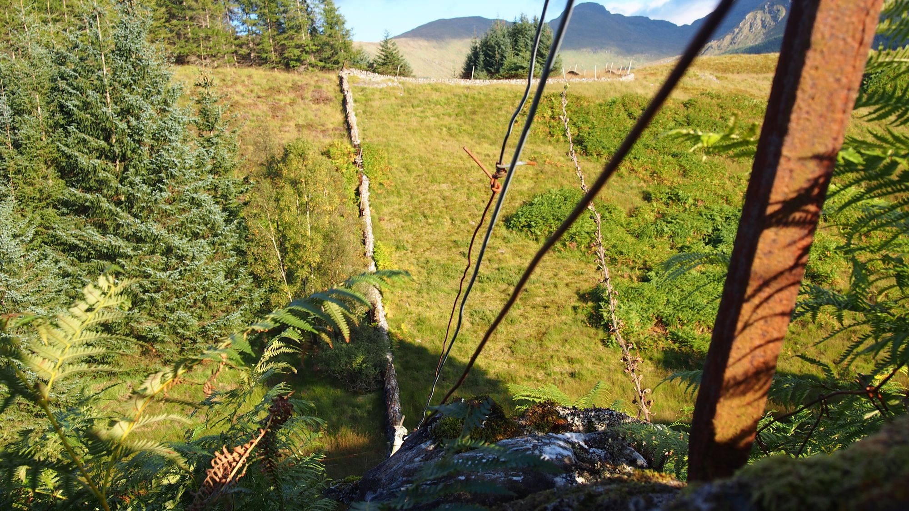
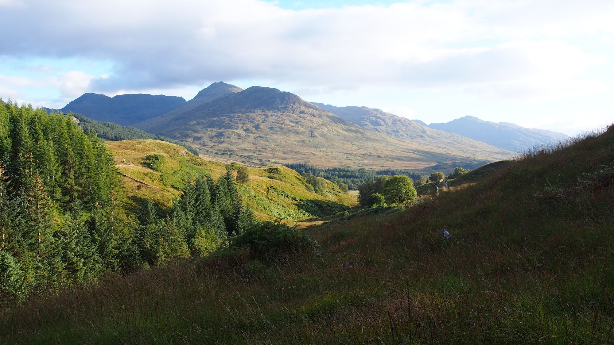

Ich habe heute nacht Halstuch wiedergefunden. Glücklicherweise, da ich frierend aufgewacht bin.

## Einheimische

Ich habe heute schon wieder einen kurzen Plausch gehalten. Ein alter Mann hat mich angesprochen, während ich meine Wasserfalsche füllte und mich daran bekräftigt das Wasser mit gutem gewissen trinken zu können, er trinke es auch schon seit Jahren. Natürlich merken die Leute, spätestens wenn ich beginne zu reden, dass mein Kilt nur Tarnung ist, doch trotzdem sind Sie alle freundlich. Der alte Mann erzählt mir, dass er als Soldat in Deutschland stationiert war und er von der guten Qualität von Nahrungsmittel im Verhältnis zu den günstigen Preisen angetan ist. Nicht gerade etwas was man sich normalerweise auf die Fahne schreiben würde und anscheinend sieht er es ähnlich wie ich: Die guten Preise wiegen halt doch nicht die wunderschöne Landschaft und Natur auf die die Gegend hier in den Highland’s zu bieten hat.

## Aussicht vs liege Komfort

Ich habe mich entscheiden heute nach uneben zu liegen. Ich bin mir noch nicht sicher ob es eine clever Entscheidung war, allerdings ist die Aussicht an meiner aktuellen Stelle deutlich besser als unten auf der geraden Wiese. Natürlich hätte ich die Aussicht auch außerhalb meines Zeltes genießen können doch der Platz am Fuße des Hügels auf dem ich Kampiere war mir durch und durch zu wieder. Nicht nur, dass er schon fast nach Zeltplatz geschrien hat und somit all meinem Bemühungen die Zivilisation zu vermeiden, zu allem Überdruss, wurde das kleine Waldstück an dem der Platz lag als Müllhalde verwendet — etliche Hügel von Klamotten lagen dort. So entscheid ich mich ein paar Meter weiter zu kampieren, um diesen Schandfleck der Zivilisation zu meiden und abstand davon zu nehmen. Die Unebenheit muss ich dafür jetzt wohl in kauf nehmen — aber das ist es mir noch wert.

## Hygiene

Manchmal ist es vermutlich auch ganz gut alleine zu reisen. Ich habe knapp mit Kleidung geplant, um mehr Platz für Lebensmittel zu haben. In dem Wissen alleine zu Reisen und eh lieber alle verscheuchend wollen, statt an zu ziehen hat mich der Gedanke auch nicht weiter gestört. Doch nun Rieche ich mich selbst — schrecklich. Ich bereu es mich gegen ein Bad entschieden zu haben, auch wenn es meine Socken und mein T-Shirt auch nicht gerettet hätte. Beides werde ich morgen auf meinem Rucksack befestigen und tagsüber auslüften lassen, in der Hoffnung es doch noch mal tragen zu können. Schließlich muss ich einen Teil meiner Wäsche auch für den Sprung in die Zivilisation aufbewahren. Die Nassen Schuhe haben aber sicher auch ihren Teil dazu beigetragen.

