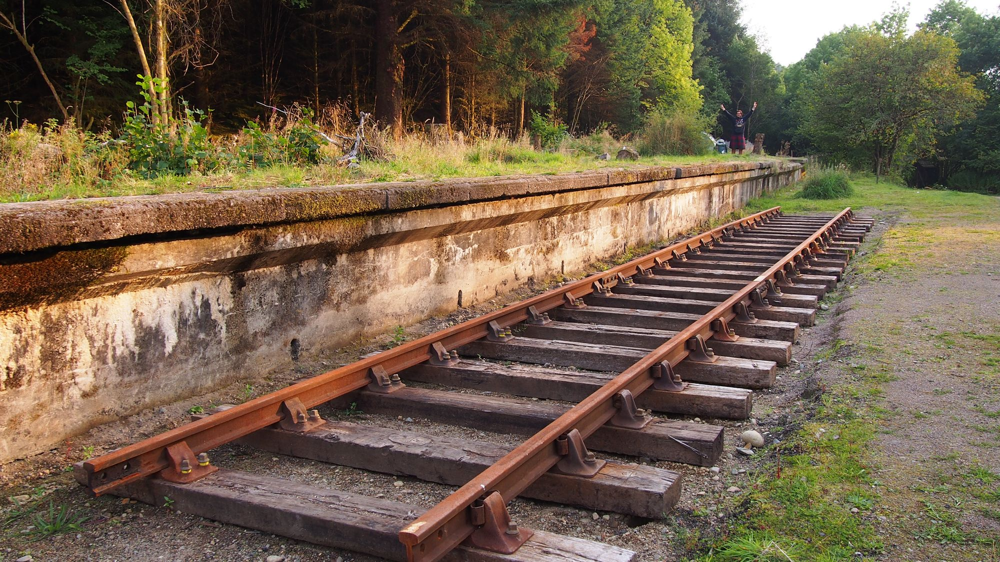
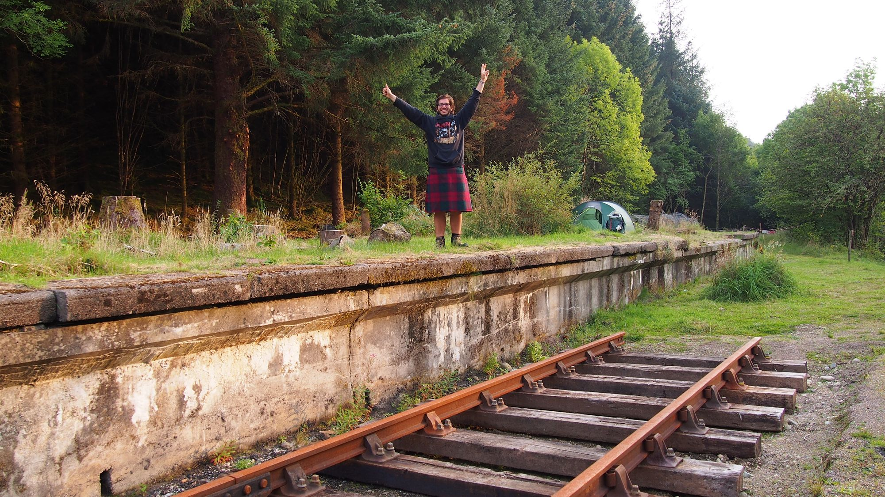
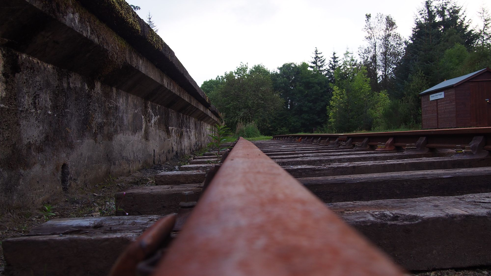
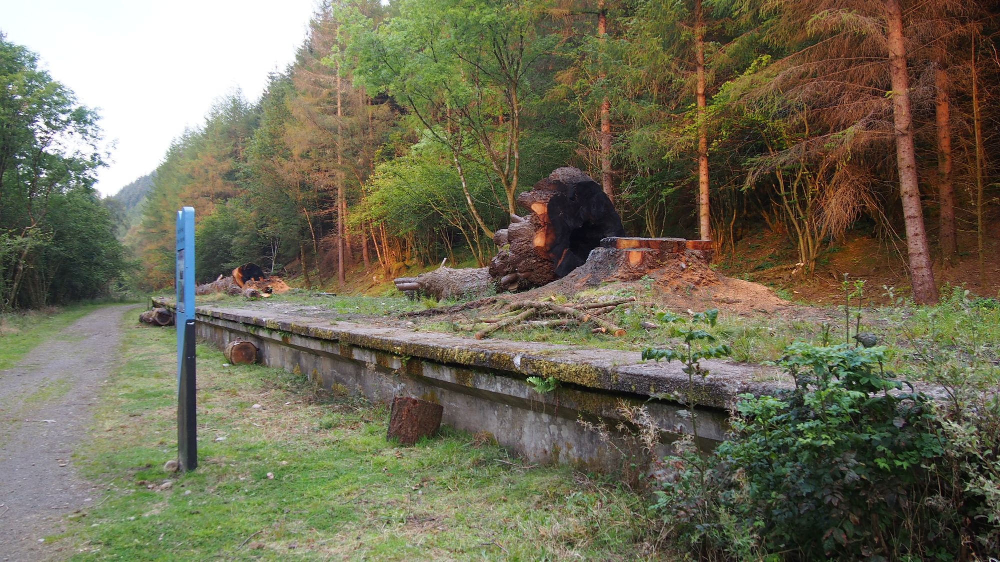
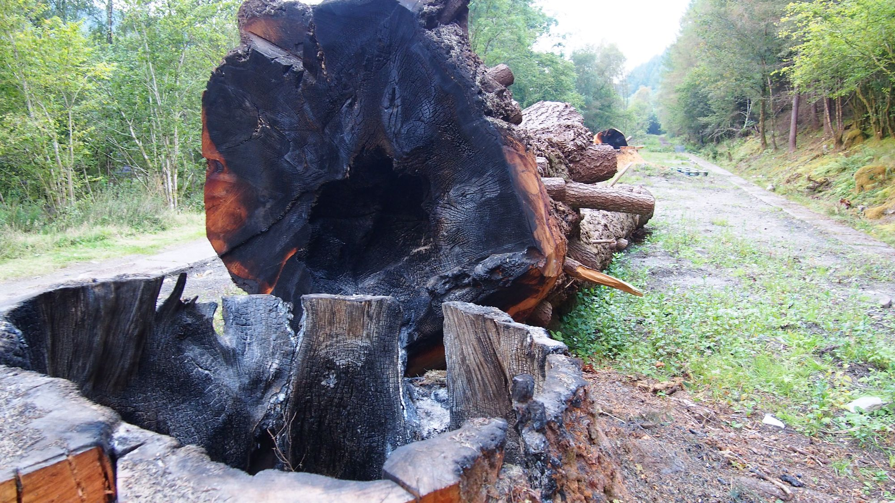

Die Sonne versucht den grauen Himmel zu durchbrechen und schafft es an einigen den Grund zu berühren. Mein Glück mit dem Wetter scheint sich zu wandeln, aber was wäre eine Englandreise ohne Regenwetter gewesen. Leider wird mein Rücken nicht besser und ich habe heute nacht kaum geschlafen. Nun ist es nicht mehr die Kälte die mir zu schaffen macht — sogar meinen Schlafsack musste ich aufmachen weil mir zu warm war — sondern mein Rücken. Ich werde schauen, ob ich Magnesium Tabletten besorgen kann und dass das leiden Mildert.

## Wasser

Ich werde das erste mal nach Wasser fragen müssen, da mein Wasser leer ist und es sich nicht abzeichnet das die nächsten Kilometer eine Quelle kommt. Nicht weit von mir steht ein kleines Häuschen, neben einer Brücke die von Hand geöffnet und geschlossen wird. Je nachdem ob ein Auto oder ein Boot kommt, wird die Brück von Hand auf oder zu gekurbelt. Der Mann der hier arbeitet wird sicher so nett sein und mir meine Flasche füllen.

## Am Bahnhof

Auf meiner Wanderrute, was es bisher nicht außergewöhnlich das ein Bahnhof etwas abseits von einem Dorf liegt, aber eine alten Verwachsen Bahnsteig habe ich bisher noch nicht gesehen. Nun sitz ich auf einem und werde auch hier Zelten. Der Bahnsteig ist bereits komplett zugewachsen und ein gigantische Baumstumpf ist tief in ihn verwurzelt. Ein mystischer und schöner Ort. Der ärger über mein Zelt das ich nicht am Seeufer aufschlagen konnte, weil der Boden zu Hart war, um die Karabiner zu versenken ist verflogen und ich Turne auf dem Gleis umher, bis ich jemanden kommen sehe. Ein alter Mann mit dem ich ins Gespräch komme und der extra einen Stop einlegte, um sich die Station anzusehen, bevor die Trasse eventuell wieder eröffnet wird. Er ist freundlich und erzählt mir von einer deutschen Freundin, nach er erfahren hatte von wo ich komme. Ich bin etwas verwirrt weil er möchte, dass ich ihn zum Auto begleite wegen der Freundin. Etwas verwirrt folge ich ihm und hoffe das er nicht erwartet, dass ich mit ihm mit fahre. Wie sich herausstellte er zusammen mit der Freundin und seiner Frau unterwegs die beide im Auto warten. Belustigt finde ich auch heraus, das seine deutsche Freundin eigentlich schon seit 13 Jahren in Schottland lebt und gar nicht aus Deutschland für einen Urlaub angereist ist.

### Die Highland und die Natur

Mir gefallen die Highland und die Menschen und ich könnte mir vorstellen hier eines Tages zu leben, etwas abseits eines Dorfes mitten in der Natur. Doch wer mag wissen was die Zukunft bringt, auf jeden Fall möchte ich erneut hier her kommen und die Berge bereisen, zwar nicht alleine und nicht zu Fuß, aber Schottland.

