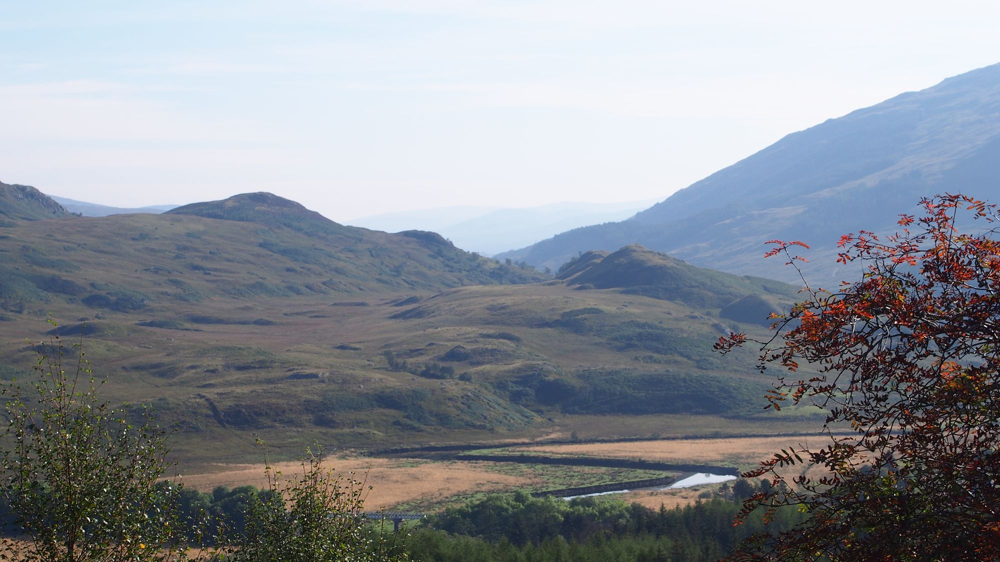
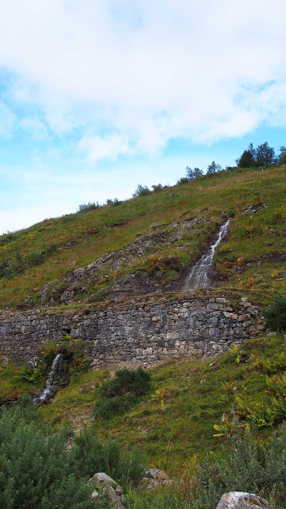
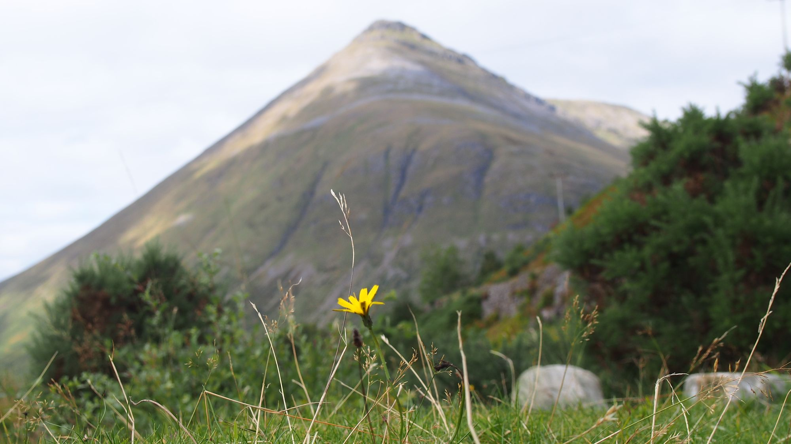
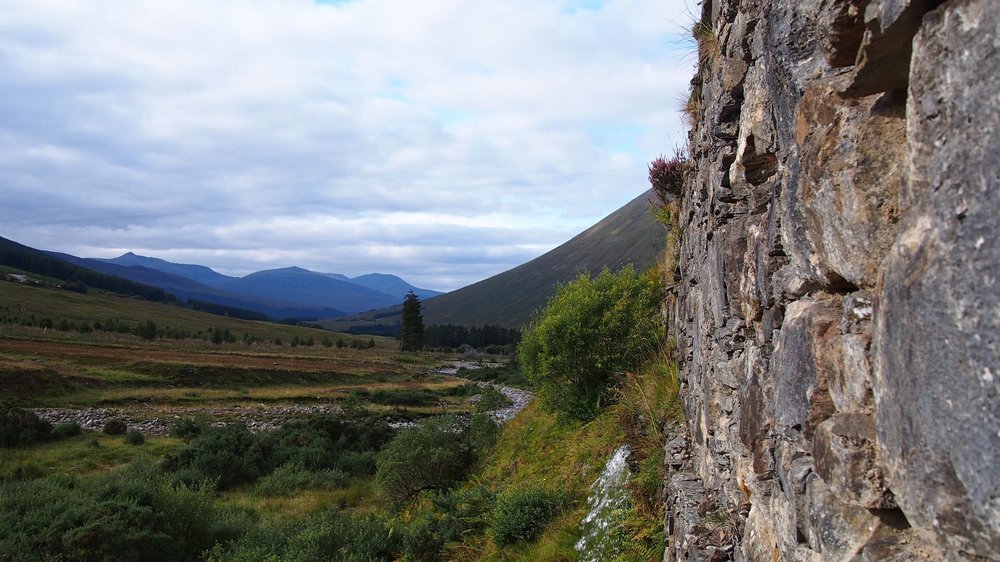
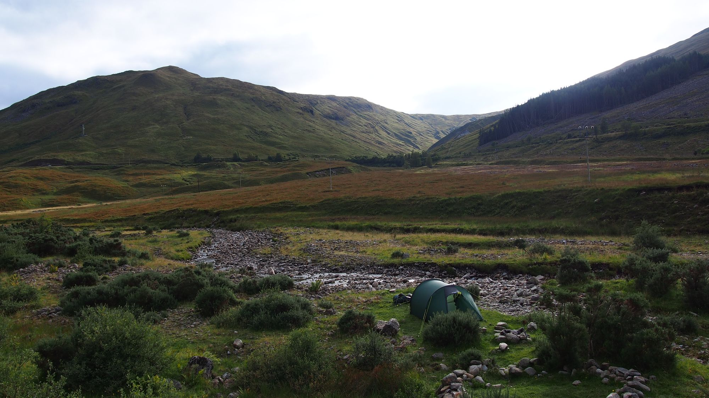
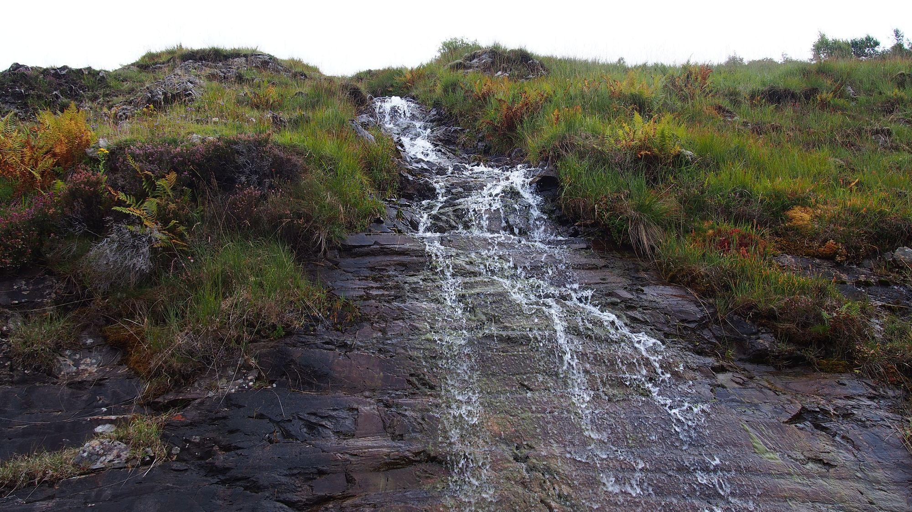

Es liegen bereits 90km hinter mir, ich komme gut voran. Das lässt mir etwas Zeit und ich muss mir Gedanken machen, dass ich nicht zu früh an meinem Ziel Inverness ankomme. Wie gehofft bleibt mir somit Zeit einen oder zwei Tage an einem Ort zu verweilen. Ursprünglich hatte ich als Puffer eingeplant am Loch Ness noch einige Nächte verbringen zu können, doch wie mir die Karte Zeit ist dieses rechts und links von einer Straße gesäumt und lädt damit nur bedingt zum verweilen ein. Ich sollte mir also früher schon einen Tag Auszeit gönnen. Noch nicht ganz aufgegeben habe ich den Gedanken in Inverness einen Host zu finden. Ich hatte auch bereits fast einen, da ich aber nicht 100% sagen konnte, wann ich ankommen würde, ist das ganze nicht zu Stande gekommen. Vielleicht kann ich in Fort William in dem mein aktueller Wanderweg endet und mein nächster beginnt, kurz ins Internet, um neue Hosts zu finden. Die Kosten für ein Hostel würde ich gerne aufgrund meines knappen Barvermögens vermeiden.

## Träume

Vergangene Nacht hatte ich einen bekannten Traum, denn ich bereits eine weile nicht mehr geträumt habe. Es ist nicht ungewöhnlich für mich nach Jahren wieder den selben Traum zu haben. Doch dieses mal ist etwas ungewöhnliches passiert, der Traum hat sich mitten drin geändert: Aus der Burg mit dunklen, kalten Verliesen wurde die Titanic. Den Untergang dieser habe ich nicht mitbekommen, aber zumindest war es warm und gemütlich — auch wenn ich auf der Hut sein musste.

## Tankstelle

Ich habe das Gefühl mein Gas geht zur neige auch, wenn ich das gar nicht richtig beurteilen kann, möchte ich auf Nummer sicher gehen und nicht verzweifelt einen Ort suchen müssen, um eine neue Kartusche zu bekommen. Also beschließe ich einen der nächsten Ort zu Nutzen und nicht zu meiden. Da der Ort an einer gut befahrenen Straße liegt, kann ich die Tankstelle nutzen, die glücklicherweise passende Kartuschen haben. Dabei kann ich nicht ganz Wiederstehen mir einen Kanister Milch zu kaufen und diesen in mich hinein zu leeren — dieses köstliche Nass. Allerdings bin ich auch froh, nicht lange an diesem Ort verweilen zu müssen, da er mir zu sehr belebt ist, durch die Tankenden und Rastenden.

## Zwischen Eisenbahn und Straße

Es ist erstaunlich wie sehr man die Straße wahrnimmt, obwohl man sie kaum sieht. Mein Zeltplatz heute liegt zwischen Schienen und einer Straße beides nimmt man Optisch gar nicht war und die Straße ist zum Glück nicht stark befahren, doch jedes einzelne Auto generiert eine lang andauernde Geräuschkulisse. Doch ich lasse mir meinen Zeltplatz davon nicht trüben und genieße den Ausblick auf einen kleinen Wasserfall der einen glatten Felsen hinabplätschert und unter dem Weg hindurch fließt und nicht nur mich einlud von ihm zu trinken.

## Peinliche Momente

Das mein Zelt gut getarnt ist mit seiner grünen Farbe, doch bei mir wäre ich davon ausgegangen, dass man mich gut sehen würde. Doch vermutlich war die junge Dame, die beim umherblicken sich stark auf den Weg konzentrierte um nach Wanderern Ausschau zu halten so auf den Weg konzentriert das Sie gar nicht bemerkte, dass sie sich genau in meine Richtung hinsetzte um Ihre Notdurft zu verrichten. Wohl über mich hinwegblickend merkte sie meine Anwesenheit wohl erst hinter. Für mich als stillen bioachter ein insgesamt lustiges Schauspiel, für sie vermutlich etwas peinlich.

