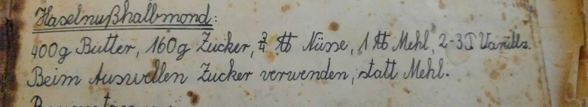

Schon lange wollte ich die alten handgeschrieben Kochbücher meiner Großmutter mitnehmen. Da sie aktuell kaum noch kocht oder backt bekam ich endlich ihre Erlaubnis. Behalten darf ich sie allerdings leider nicht. Aber ein guter Grund die Rezepte mit euch zu teilen und sie auch für mich zu archivieren. So bagann ich noch direkt auf der Heimreise das erste Rezept raus zu suchen. Da es spät werden würde bis ich zu Haus wäre sollte es etwas einfaches schnelles sein - eine gleinigkeit zum knabbern.

**Zutaten:**  
400 g Butter  
160 g Zucker  
375 g Nüsse (gemalen)  
500 g Mehl  
2-3 tl. Vanillezucker

**Anleitungen**  
Alle Zutaten müssen zusammen in eine Schüssel gegeben werden und kräftig von Hand durch geknetet werden, bis alle Zutaten zu einer Maße verschmolzen sind.

Wenn der Teig fertig ist, kann während des Formen schon mal der Backofen auf 180 Grad Ober-/Unterhitze aufgeheizt werden. Ein Vorheizen und warten bis die Temperatur erreicht ist, sollte nicht nötig sein. Das erste Blech verweilt dann zwar etwas länger im Ofen, insgesammt ist es aber immer noch kürzer als Aufwährmzeit + Backzeit.

Laut Rezept meiner Großmutter, soll Zucker ausgestreut werden, anstatt wie sonst üblich Mehl und der Teig darauf ausgerollt werden. Wir haben auch auf grund des Zuckers auf das Ausrollen verzichtet und einfach ca 1 cm große Kugeln geformt. Dieser verlaufen beim backen etwas, so das es nicht nötig ist sie zu perfekt zu formen. Dem Namen nach sollten wohl eher Halbmonde geformt werden, aber diese Änderung sollte dem Geschmack nicht abträglich sein. Da ich mich nicht erinnern kann den gebackenen Teig je in Form von Halbmonden gegessen zu haben, kann ich dies aber nur bedingt beurteilen. Auch der beim Ausrollen vermiedene Zucker fehlte uns nicht.

Wie bei allen Keksen sollte beim Formen darauf geachtet werden, dass alle Kekse gleich dick beziehungsweise gleich groß sind. So wird verhindert, dass das eine Keks verbrennt wärend die andernen noch gar nicht fertig sind.

> Meist finde ich es gar nicht so schlecht, wenn ein Keks nicht ganz durch ist, der ungebackene Teig ist schließlich auch lecker. Deswegen nehm ich selbst es mit der gleichen größe nur bedingt ernst.

Die Kekse brauchen etwas zum Zeit zum abkühlen und sind bis dahin sehr instabil - also vorsichtig vom Blech nehmen.

