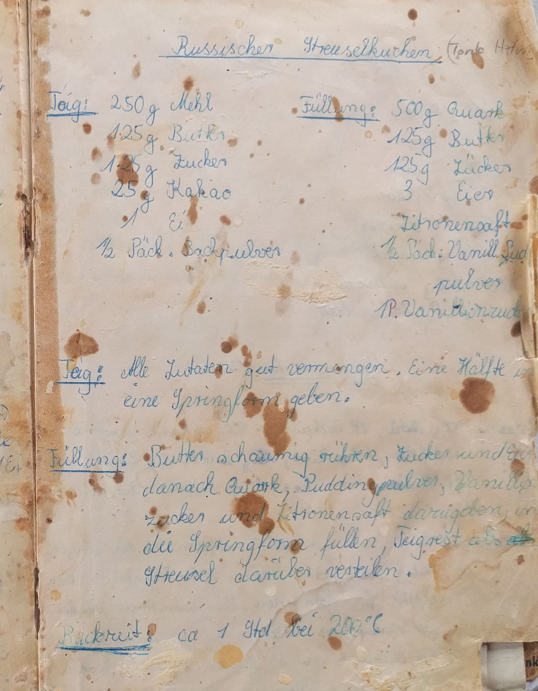

Ich weiß zwar gar nicht mehr, wie ich dazu kam, mir russischen Zupfkuchen zu backen, dennoch ist er eigentlich die Anfangsmotivation für diesen Blog / dieses Archiv, da ich ein echt gutes Rezept auf irgendeiner kleinen Seite gefunden hatte. Doch eines Tages war die ganze Seite offline. Dies ist jetzt eine modifizierte Version aus dem Rezeptbuch meiner Großmutter.

Teig:

-   250g Mehl
-   125g Butter
-   125g Zucker
-   35g Kakao
-   1 Ei
-   1/2 Päckchen Backpulver

Füllung:

-   500g Quark
-   125g Butter
-   125g Zucker
-   3 Eier
-   Zitronensaft
-   1/2 Esslöffel Speißestärke
-   1-2 Päckchen Vanillezucker

Im Gegensatz zu andern Kuchen wie einem Rotweinkuchen, ist ein russischer Zupfkuchen doch etwas aufwänidiger auch wenn sich der Aufwand in Grenzen hält.

-   Backzeit: 60 min bei 180°C Oberunterhitze
-   Zubereitungszeit: < 30 min

Zuerst sollte der Teig zusammengemischt werden, damit er noch kurz im Kühlschrank ruhen kann, um sich zu verfestigen. Die Butter sollte zur einfacheren Verarbeitung ruhig etwas weich sein, dies ist aber nicht zwingend erforderlich. Um das Kneten zu vereinfachen, die Butter mit einem Messer etwas verkleinern und eventuell mit dem Rührgerät weiter verkleinern. Wenn alle Zutaten für den Teig in der Schüssel sind, diese gut mit den Händen verkneten. Die Masse wirkt am Anfang sehr trocken, dies gibt sich allerdings mit der Zeit. Sobald eine einheitliche Masse entstanden ist, kann der Teig, bis die Füllung fertig ist, kurz in den Kühlschrank.

Für die Füllung zuerst einmal die Butter mit dem Zucker verrühren. Anschließend die Eier hinzugeben und erneut verühren. Nun können die restlichen Zutaten zugefügt werden. Diese müssen ebenfalls verrührt werden.

Damit ist die Füllung bereits fertig. Bevor die Form mit dem Teig ausgelegt werden kann, sollte diese noch eingefettet werden. Dafür eignet sich perfekt das Butterpapier, mit dem einfach in der Form herumgefahren werden kann.

Nun ca. die Hälfte des Teiges nehmen und in der Springform als Boden und Rand ausbreiten. Dafür den Teig als dicken Fladen in die Form geben und durch weiteres Plattdrücken in der Form verteilen, bis auch der Rand der Springform bedeckt ist. Um später eine gute Mischung von Teig und Füllung zu haben, ist es wichtig, dass nicht zu viel Teig in den Kante der Form ist.

Nachdem die Füllung in die Form gegeben worden ist, muss nur noch der restliche Teig über der Form zerkrümmelt werden.

Ich kann zwar auch nie abwahrten, bis der Kuchen kalt ist, doch richtig gut schmeckt er erst, wenn er richtig abgekühlt ist. Dies kann je nach Wetter und Umgebungstemperatur ein paar Stunden dauern und stellt somit die größte Geduldsprobe dar.

